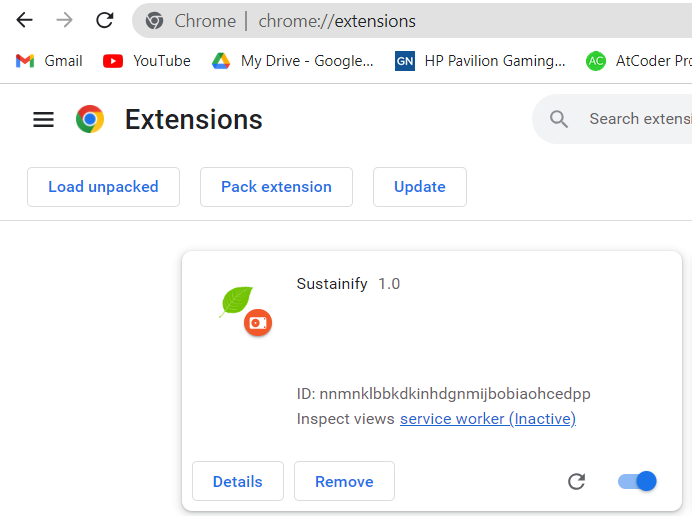
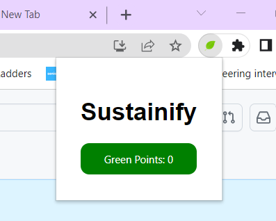

# Chrome extension

## Description

This is a browser extension that provides sustainability ratings for products on websites. It helps users make informed choices by displaying the environmental impact of products and calculating their green points.

## Installation

1. Download the extension package(sustainify folder) from the chrome-extension branch.
2. Extract the contents of the package to a local directory.
3. Open your browser and navigate to the extension management page:
   - For Google Chrome: Go to `chrome://extensions/`
4. Enable the "Developer mode" option if not already enabled.
5. Click on "Load unpacked" and select the extracted extension folder.
6. The extension should now be installed and ready to use.

## Usage

1. Browse the supported website (https://lucky-gumdrop-70ee17.netlify.app/).
2. The extension will automatically display the sustainability ratings for each product, indicating their environmental impact.
3. Interact with the products as usual, and the extension will keep updating the sustainability ratings.
4. Click on the extension's toolbar icon to view green points acquired.

